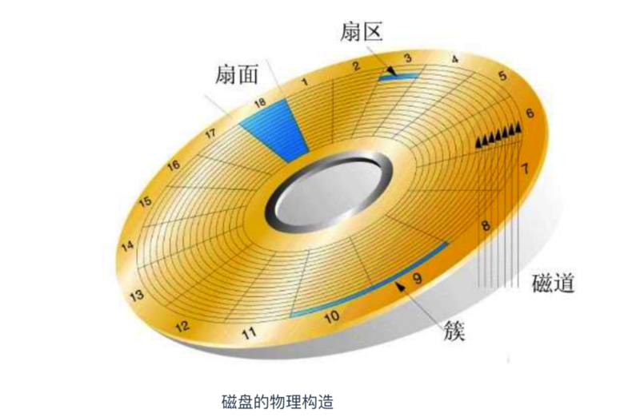

## js概念

### TCP连接三次握手,四次挥手

建立TCP连接需要三次握手：
1. 客户端向服务器发起连接请求，
2. 服务器收到后（确认客户端连接正常），向客户端发收到请求。
3. 客户端收到后（确认自己和服务器都连接正常）发确认连接请求（让服务器确认自己连接正常），建立连接。

关闭TCP连接需要四次挥手：
1. 客户端发出关闭连接请求
2. 服务器发出是否关闭请求
3. 客户端发出确认关闭请求
4. 服务器发出已关闭信息。

### JS单线程。

1. JS同时只能执行一个JS任务。JS主要用于用户交互和操作DOM，如果多线程的话，一个线性在DOM上添加内容，一个线性删除内容，会麻烦
2. 浏览器或node环境是多线性，辅助js线程
3. js引擎线程（主线程）运行js代码，遇到 setTimeout就把它交给浏览器的 定时器触发线程处理， ajax交给http异步线程处理， dom.onclick(fn()) 交给浏览器事件线程去执行
4. 主线程执行同步代码，遇到异步代码就交给浏览器异步线程，浏览器异步线程执行异步代码成功后，把回调函数丢进队列。 主线程执行完代码就去队列看一下，有没有回调函数要执行
5. 主线程、异步线程、消息队列，三者通过EventLoop事件循环来沟通

### 网络通信，数据加密

对称加密（速度快）： 数据加密和解密用同一个密钥。双方一起保管。密钥传输麻烦

非对称加密RSA:
1. 双方有一对钥匙，一个私钥（保密的），一个公钥（公开的）。
2. 用私钥加密的数据，只有对应的公钥才能解密。
3. 用公钥加密的数据，只有对应的私钥才能解密。
4. A给B发消息时，用B的公钥加密，B收到后，用B的私钥解密。
5. 把公钥和信息通过hash算法生成消息摘要，用CA(认证)私钥加密，生成数字签名，再把公钥和信息、数字签名合并成数字证书。
6. CA证书会有操作系统/浏览器预置顶级CA证书来保证没被篡改

### https 就是用了CA证书

1. 客户端发出请求
2. 服务器发送数字证书（公钥）给客户端
3. 浏览器用公钥加密请求数据
4. 服务器用私钥解密响应数据

### CPU缓存： CPU速度比内存快，内存比硬盘快

### 二进制：

1. 计算机是没有减法的，当计算 1-1时，会转换成1+（-1）， 
2. -1 ：1的值为 0000 0001， 再取反为  1111 1110 再加1，最终值为 1111 1111 
3. 最后相加高位1溢出，直接忽略

### 磁盘

磁道是指同心圆区域

> 印度

印度分离出了巴基斯坦，种族歧视，等级歧视，性别歧视。女性地位低

> 古巴比伦

古巴比伦就是伊拉克！被入侵，建立 新巴比伦王图，国王建立“空中花园”，地理位置特殊，夹在亚洲、欧洲、非洲中间，经常战乱。
后来成立了伊拉克，石油全球有名，萨达姆当政。打战抢邻国石油，最后引发2003年伊拉克战争，萨达姆被绞死，被恐怖组件ISIS统治

> 古埃及

埃及被亚历山大带希腊人干掉了。接下来被希腊人统计。金字塔是法老的坟墓。希腊人内乱，后又被罗马干掉，再被阿拉伯人统治，最后变成英国殖民地。现在穷！

> 希腊

希腊：宙斯。环境好。一堆小岛，各自称王。形成城邦国家。团结打败入侵的波斯，小兵报喜，创立了马拉松长跑。又内乱了。最后被亚历山大入侵统治，此时发展最好，有苏格拉底、柏拉图。被罗马征服，被土耳其剥削
最后独立。国家没钱，借钱还不起。四年一次的奥运会要去希腊取圣火。

> 罗马，西罗马变成意大利

凯撒大帝 扑克方块K, 屋大维时，罗马帝国几乎代表整个欧洲。后来分成东西罗马帝国。意大利属于西罗马帝国。意大利被匈奴入侵，被打败。意大利分列成小国。出现了基督教，社会大乱，黑暗的中世纪，持续1000年。然后达芬奇出现，文艺复兴，这让有钱人看到希望。此时意大利被其他国家统治。最后独立。一二战很垃圾。现在米兰有时装和模特。还有威尼斯水城。  

