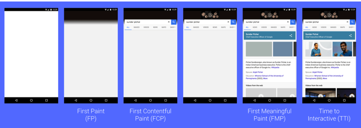
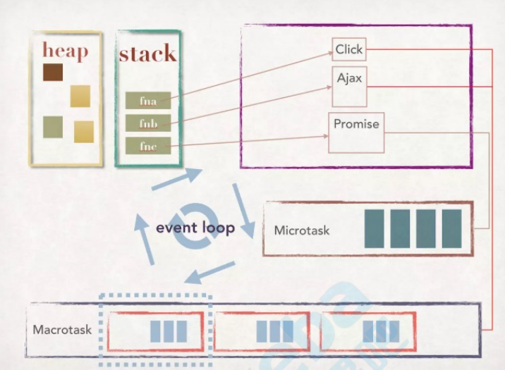

## js优化

### 图片

雪碧图

base64

webp svg

### cdn

### gzip  

webpack4有 gzip压缩

### 代码压缩

### webpack

### window.performance

```js
const timingInfo = window.performance.timing;
console.log({
"TCP连接耗时":timingInfo.connectEnd - timingInfo.connectStart,
"DNS查询耗时":timingInfo.domainLookupEnd - timingInfo.domainLookupStart,
"获得⾸首字节耗费时间，也叫TTFB":timingInfo.responseStart -
timingInfo.navigationStart,
"domReady时间":timingInfo.domContentLoadedEventStart -
timingInfo.navigationStart,
"DOM资源下载":timingInfo.responseEnd - timingInfo.responseStart
})
```



FP:首次渲染时间

FCP：白屏:浏览器首次渲染任何文本、图像等的时间

FMP：有意义的绘制，主要内容出现时

TTI：用户可交互时间，优化重点

### 浏览器缓存

1. 强缓存

   1. expires  http1.0过期时间:  首次发起请求的时候， 服务端会在Response Header当中设置expires字段，是具体时间。再次请求就对比时间有没有过期，来决定是否缓存

   2. cache-control  http1.1

      服务端的时间和本地时间会存在误差，出现cache-control，是相对时间

      max-age=315360000   优先级比 expires 高

      private：设置了该字段值的资源只能被用户浏览器缓存，不允许任何代理理服务器缓存。在实际开发当中，对于一些含有用户信息的HTML，通常都要设置这个字段值，避免代理服务器(CDN)缓存； 
      no-cache：设置了该字段需要先和服务端确认返回的资源是否发⽣生了变化，如果资源未发⽣生变化，则直接使⽤用缓存好的资源；
      no-store：设置了该字段表示禁止任何缓存，每次都会向服务端发起新的请求，拉取最新的资源；
      max-age=：设置缓存的最大有效期，单位为秒；
      s-maxage=：仅适⽤用于共享缓存(CDN)，优先级高于max-age或者Expires头； 
      max-stale[=]：设置了该字段表明客户端愿意接收已经过期的资源，但是不能超过给定的时间限制。

2. 协商缓存

   Last-Modified/If-Modified-Since

   如果有设置协商缓存，我们在首次请求的时候，返回的Response Headers会带有Last-Modified。当再 次请求没有命中强制缓存的时候，这个时候我们的Request Headers就会携带If-Modified-Since字段， 它的值就是我们第一次请求返回给我们的Last-Modified值。服务端接收到资源请求之后，根据If- Modified-Since的字段值和服务端资源最后的修改时间是否一致来判断资源是否有修改。如果没有修 改，则返回的状态码为304；如果有修改，则返回新的资源，状态码为200。 

   Etag/If-None-Match

   服务端对Last-Modified标注的最后修改时间只能精确到秒级。如果某些⽂文件在1秒钟以内被修改多次的话，这个时候服务端⽆无法准确标注⽂文件的修改时间。 出现了Etag/If-None-Match. Etag根据文件的具体内容计算出hash值，更准确
   
   ### event-loop
   
   
   
   任务队列： Microtask 优先级比Macrotask高
   
   Microtask: process.nextTick(node) >Promise > MutationObserver > Macrotask
   
   Macrotask: setTimeout、 setInterval、I/O、UI Rendering、script当中的所有代码、
   setImmediate(Node)
   
   Microtask 当中的任务也是在执行栈当中的任务执行完成后再进行执行，执行的时候和Macrotask 有一些区别，Microtask 当中任务不会⼀个压入执行栈，而是所有任务直接压入栈中， 当 Microtask 当中的任务执行完毕后，然后我们再从 Macrotask 中取栈顶的第⼀个任务进行执行。
   
### lighthouse?

chrome插件

npm i -g lighthouse

 lighthouse xxx.com

### 节流、防抖

代码在es6.md

### 图片懒加载原理

```js
// 监听Scroll事件
window.addEventListener('scroll', lazyload, false);
function lazyload () {
  // 获取所有的图⽚片标签
  const imgs = document.getElementsByTagName('img');
  // 获取可视区域的⾼高度
  const viewHeight = window.innerHeight ||
    document.documentElement.clientHeight;
  // num用于统计当前显示到了哪⼀一张图⽚片，避免每次都从第⼀一张图片开始检查是否露出
  let num = 0;
  for (let i = num; i < imgs.length; i++) {
    // ⽤用可视区域高度减去元素顶部距离可视区域顶部的⾼高度
    let distance = viewHeight - imgs[i].getBoundingClientRect().top;
    // 如果可视区域⾼高度⼤大于等于元素顶部距离可视区域顶部的⾼高度，说明元素露露出
    if (distance >= 0) {
      // 给元素写入真实的src，展示图⽚片
      imgs[i].src = imgs[i].getAttribute('data-src');
      // 前i张图⽚片已经加载完毕，下次从第i+1张开始检查是否露露出
      num = i + 1;
    }
  }
}
```

### 回流、重绘

1. 回流：修改DOM的元素宽高，隐藏等，改变了元素的位置，回流必重绘
2. 重绘：改颜色

### dom性能优化

少操作dom，用fragment，虚拟dom

### Object.freeze()

vue 冻结数据

## 问题

1. ETags

2. 延迟加载、预加载、懒加载

4. chrome的performance

   Idle 表示空闲性能

3. dns-prefetch(淘宝例子)

4. IP TCP HTTP

5. 缓存控制

   1. disk cache  硬盘缓存
   2. memory cache 内存缓存

7. http2

8. event-loop

9. push cache http2的缓存

10. vue 服务端渲染   nuxt.js 

## 白屏解决：

骨架屏 page-skeleton-webpack-plugin, 

插件依赖 html-webpack-plugin 3.x，   webpack4的 html-webpack-plugin是4.x 骨架屏插件安装失败

针对vue的骨架屏  vue-skeleton-webpack-plugin 待实践

## 视频

发现百度网盘慕课网有一些优化的视频。

## 书

Web 前端性能优化 陈铎鑫 2020 这书找不到

高效前端：Web高效编程与优化实践  2018

大型网站性能检测、分析与优化  2016-6   

web性能权威指南 2013

暂停