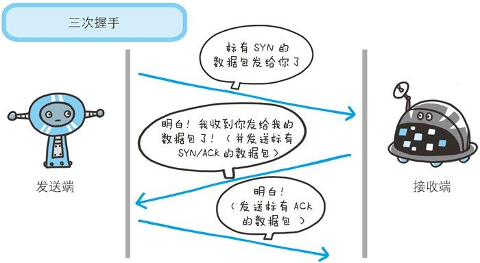
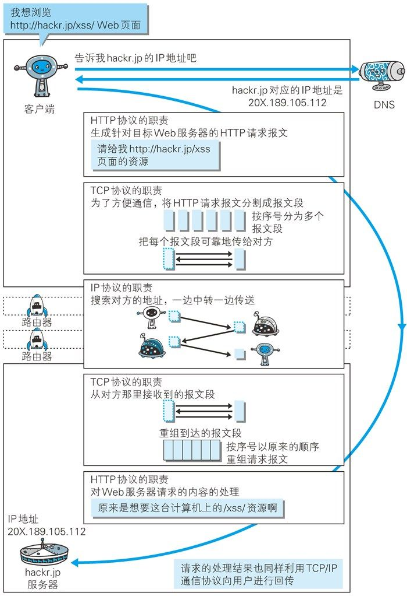
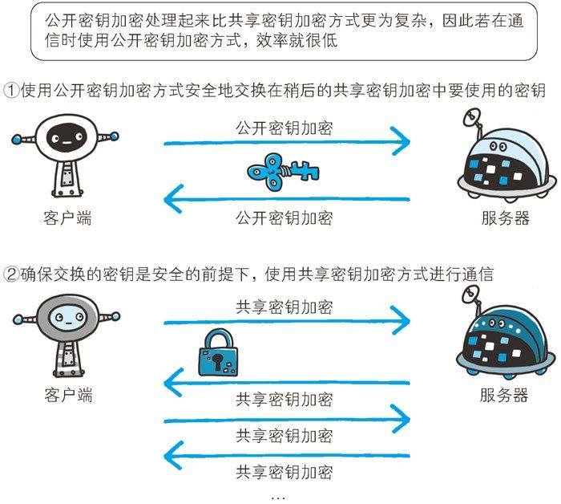

## js概念

### JS单线程。

1. JS同时只能执行一个JS任务。JS主要用于用户交互和操作DOM，如果多线程的话，一个线性在DOM上添加内容，一个线性删除内容，会麻烦
2. 浏览器或node环境是多线性，辅助js线程
3. js引擎线程（主线程）运行js代码，遇到 setTimeout就把它交给浏览器的 定时器触发线程处理， ajax交给http异步线程处理， dom.onclick(fn()) 交给浏览器事件线程去执行
4. 主线程执行同步代码，遇到异步代码就交给浏览器异步线程，浏览器异步线程执行异步代码成功后，把回调函数丢进队列。 主线程执行完代码就去队列看一下，有没有回调函数要执行
5. 主线程、异步线程、消息队列，三者通过EventLoop事件循环来沟通

### 网络通信，数据加密

对称加密（速度快）： 数据加密和解密用同一个密钥。双方一起保管。密钥传输麻烦

非对称加密RSA:
1. 双方有一对钥匙，一个私钥（保密的），一个公钥（公开的）。
2. 用私钥加密的数据，只有对应的公钥才能解密。
3. 用公钥加密的数据，只有对应的私钥才能解密。
4. A给B发消息时，用B的公钥加密，B收到后，用B的私钥解密。
5. 把公钥和信息通过hash算法生成消息摘要，用CA(认证)私钥加密，生成数字签名，再把公钥和信息、数字签名合并成数字证书。
6. CA证书会有操作系统/浏览器预置顶级CA证书来保证没被篡改

### https 就是用了CA证书

1. 客户端发出请求
2. 服务器发送数字证书（公钥）给客户端
3. 浏览器用公钥加密请求数据
4. 服务器用私钥解密响应数据

### CPU缓存： CPU速度比内存快，内存比硬盘快

### 二进制：

1. 计算机是没有减法的，当计算 1-1时，会转换成1+（-1）， 
2. -1 ：1的值为 0000 0001， 再取反为  1111 1110 再加1，最终值为 1111 1111 
3. 最后相加高位1溢出，直接忽略


### 磁盘

磁道是指同心圆区域


## 国家

> 印度

印度分离出了巴基斯坦，种族歧视，等级歧视，性别歧视。女性地位低

> 古巴比伦

古巴比伦就是伊拉克！被入侵，建立 新巴比伦王图，国王建立“空中花园”，地理位置特殊，夹在亚洲、欧洲、非洲中间，经常战乱。
后来成立了伊拉克，石油全球有名，萨达姆当政。打战抢邻国石油，最后引发2003年伊拉克战争，萨达姆被绞死，被恐怖组件ISIS统治

> 古埃及

埃及被亚历山大带希腊人干掉了。接下来被希腊人统计。金字塔是法老的坟墓。希腊人内乱，后又被罗马干掉，再被阿拉伯人统治，最后变成英国殖民地。现在穷！

> 希腊

希腊：宙斯。环境好。一堆小岛，各自称王。形成城邦国家。团结打败入侵的波斯，小兵报喜，创立了马拉松长跑。又内乱了。最后被亚历山大入侵统治，此时发展最好，有苏格拉底、柏拉图。被罗马征服，被土耳其剥削
最后独立。国家没钱，借钱还不起。四年一次的奥运会要去希腊取圣火。

> 罗马，西罗马变成意大利

凯撒大帝 扑克方块K, 屋大维时，罗马帝国几乎代表整个欧洲。后来分成东西罗马帝国。意大利属于西罗马帝国。意大利被匈奴入侵，被打败。意大利分列成小国。出现了基督教，社会大乱，黑暗的中世纪，持续1000年。然后达芬奇出现，文艺复兴，这让有钱人看到希望。此时意大利被其他国家统治。最后独立。一二战很垃圾。现在米兰有时装和模特。还有威尼斯水城。  

## http/1.1

超文本传输协议： HTTP 是一个在计算机世界里专门在两点之间传输文字、图片、音频、视频等超文本数据的约定和规范

超文本：包含文字、图片、视频等广义上的文本

1. 明文传输不安全，HTTP 协议的实现本身非常简单，不论是谁发送过来的请求都会返回响应
2. 无法证明请求报文和响应报文的完整性，可能被篡改

http协议由请求头Request Header或响应头Respose Header,统称Header 和body(消息正文)组成，body非必须

http默认端口80

### 网络模型

应用层：HTTP协议，SMTP(电子邮件传送协议)，FTP(文件上传协议)，DNS(域名解析协议)

传输层：TCP协议、UDP协议

网络层：IP协议(使用 `IP 地址` 来标识互联网上的每一台计算机)

链路层：网络（以太网、WiFi）

客户端在应用层（HTTP协议）发出一个想看`http://www.baidu.com` 页面的http请求,为了传输方便，在传输层(TCP协议)把接收到的数据(HTTP请求报文)进行分割处理，在网络层(IP协议)增加MAC地址后转发到链路层(网络) 。接收端的服务器在链路层接收到数据， -> 网络层 -> 传输层 -- 应用层，当传输到应用层，才算接收到客户端发送过来的http请求

客户端： 应用层 http协议 --  传输层 TCP协议 -- 网络层 IP协议 ------> 链路层 网络  

服务器： 链路层 网络 -- 网络层 IP协议 -- 传输层 TCP协议 -----> 应用层http协议

### IP协议

把数据包传送给对方。利用IP地址和MAC地址

### TCP协议

为了更容易传送大数据才把数据分割，能够确认数据最终是否送达到对方。采用了三次握手策略

### TCP连接三次握手,四次挥手

建立TCP连接需要三次握手：

1. 客户端向服务器发起连接请求，
2. 服务器收到后（确认客户端连接正常），向客户端发收到请求。
3. 客户端收到后（确认自己和服务器都连接正常）发确认连接请求（让服务器确认自己连接正常），建立连接。

关闭TCP连接需要四次挥手：

1. 客户端发出关闭连接请求
2. 服务器发出是否关闭请求
3. 客户端发出确认关闭请求
4. 服务器发出已关闭信息。



### 地址栏输入URL过程

1. 我们在地址栏输入URL（即网址，如`http://www.baidu.com`）
2. DNS服务器会首先进行**域名映射**。找到对应的IP地址。
3. http客户端建立起**TCP连接**。
4. 发送http**请求报文**，http服务器解析报文，获取数据封装到http**响应报文**，发给用户。
5. 客户接到响应报文后，**断开TCP**连接。
6. HTTP客户端从响应报文提取出html响应文件。通过浏览器显示出来。



### CDN

是构建在现有网络基础之上的网络，它依靠部署在各地的边缘服务器，通过中心平台的负载均衡、内容分发、调度等功能模块，使用户**就近**获取所需内容 。  缓存、代理、分发等

### DNS协议

把 IP 地址转换为便于人类记忆的协议 ，DNS 协议提供通过域名查找 IP 地址，或逆向从 IP 地址反查域名的服务。

### URI

唯一地标记互联网上资源:  包含URL(网址)+URN(统一资源名称)

### cookie

http是不保存状态的协议，不对请求和响应之间的通信状态进行保存，为了保持用户的登陆状态，出现了cookie

### If-Modified-since

请求头出现 If-Modified-since: Thu, 12 Jul 2012 07:30:00 GMT 服务器会响应仅返回这个时间以后更新过的index.html页面资源，如果未有内容更新，则以304 Not Modified作为响应返回

相关资料在6.4.9

### get post put head delete options

PUT 可传输文件，但http/1.1的put方法不带验证机制，任何人都可以上传文件，不安全，不使用

delete删除文件，也不安全，不使用

head 获得报文首部，用于确认 URI 的有效性及资源更新的日期时间等。少用

options 查询针对请求URI指定的资源支持的方法（返回 Allow: get post,head等）

这些都跟具体应用不太一样。。

### keep-alive

http1.1以前，当请求包含多张图片的html链接时

1. 获取html文档：建立TCP连接，HTTP请求/响应，断开TCP连接
2. 获取图片1：建立TCP连接，HTTP请求/响应，断开TCP连接
3. 获取图片N: 建立TCP连接，HTTP请求/响应，断开TCP连接

会不断地建立TCP连接，每次的请求都会造成无谓的 TCP 连接建立和断开，增加通信量的开销。

Connection:close  非持久连接，要求服务器发送完响应的对象后就关闭连接 

此时出现了持久连接 keep-alive 即保持TCP连接状态，一次性发完所有http请求/响应。

在http/1.1中，所有连接默认都是持久连接  `Connection: keep-alive`  

### Range

响应头包含 Content-Range (请求一个10000字节的资源，断网后，使用范围请求，可以只请求剩余的5001~10000的部分数据) 

请求头 range:bytes=0-

响应头 accept-ranges:bytes

​			Content-Range: bytes 0-34343/343434

ETag

接口的response data 才有  6.5.3

### 管线化

持久连接使得多数请求以管线化（pipelining）方式发送成为可能。从前发送请求后需等待并收到响应，才能发送下一个请求。管线化技术出现后，不用等待响应亦可直接发送下一个请求。

这样就能够做到同时并行发送多个请求，而不需要一个接一个地等待响应了。

### 状态码

204 请求成功，没资源可返回

206 范围请求Range-Request  

401 未认证Unauthorized

403 Forbidden 没权限

500 Internal Server Error

503 Service Unavailable(服务器处于超负载或停机维护)

### 代理服务器 Via

接收客户端发送的请求后转发给其他服务器。每次通过代理服务器转发请求或响应时，会追加写入 Via 首部信息。就是 响应头的 Via 。 利用缓存技术减少网络带宽的流量。包含**缓存服务器**

### 网关服务器 Via

转发其他服务器通信数据，接收从客户端发送来的请求时，它就像自己拥有资源的源服务器一样对请求进行处理。有时客户端可能都不会察觉，自己的通信目标是一个网关。应用：购买用信息卡结算时，网关可以和信用卡结算系统联动。

## XMLHttpRequest + express

```html
// url:  http://localhost:8888/pcgomweb/1.html
<!DOCTYPE html>
<html lang="en">
<head>
  <meta charset="UTF-8">
  <title>Title</title>
</head>
<body>
<script>
  // 原生 + express
  function ajax (obj) {
    let URL='http://localhost:3000/'
    let xmlhttp = new XMLHttpRequest();
    xmlhttp.onreadystatechange = function () {
      if (xmlhttp.readyState === 4 && xmlhttp.status === 200) {
        // 请求成功
        console.log(xmlhttp.responseText);
      }
    }
    xmlhttp.open("post", URL+ 'submit', true);
    xmlhttp.setRequestHeader("Content-type", "application/x-www-form-urlencoded");  // 设置请求头
    xmlhttp.send("res=" + JSON.stringify(obj));
  }
  ajax({
    age:31
  })
</script>
</body>
</html>
```

```js
// node api.js
var express = require('express');
var cors = require('cors');
var bodyParser = require('body-parser');   // 获取 post 请求参数    req.body
var app = express();

let arr = [];
app.use(cors()); // 跨域

// 添加json解析
app.use(bodyParser.json());
app.use(bodyParser.urlencoded({extended: false}));

// get
app.get('/a', function (req, res) {
  res.send('aaa');
});

app.get('/age', function (req, res) {
  res.send(arr[0])
});

// post
app.post('/submit', function (req, res) {
  console.log(JSON.parse(req.body.res));
  let {age} = JSON.parse(req.body.res);
  arr=[];
  arr.push(age);
  console.log('body', age);
  console.log('arr',arr);
  res.json({
    result: 'haha'
  });
});
app.listen(3000, function () {
  console.log('Example app listening on port 3000!');
});
```

### 接口请求头/响应头

请求头

```http
Accept: */*
Accept-Encoding: gzip, deflate, br
Accept-Language: zh-CN,zh;q=0.9
Cache-Control: no-cache   // 默认不缓存
Connection: keep-alive
Content-Length: 14
Content-type: application/x-www-form-urlencoded  // 这个是设置的，其他都是默认的
Host: localhost:3000   // api服务器域名
Origin: http://localhost:8888  // 本地服务器域名
Pragma: no-cache
Referer: http://localhost:8888/pcgomweb/1.html  //  当前链接
Sec-Fetch-Dest: empty
Sec-Fetch-Mode: cors
Sec-Fetch-Site: same-site
User-Agent: Mozilla/5.0 (Windows NT 10.0; Win64; x64) AppleWebKit/537.36 (KHTML, like Gecko) Chrome/83.0.4103.61 Safari/537.36
```

响应头

```http
Access-Control-Allow-Origin: *    // 这个是设置的，其他都是默认的
Connection: keep-alive
Content-Length: 17
Content-Type: application/json; charset=utf-8   // 这个是设置的 res.json()
Date: Wed, 26 Aug 2020 03:06:42 GMT
ETag: W/"11-AUjVioKC+y0tfWxgttKaPngTxTA"
X-Powered-By: Express         // 框架
```

### index.html请求头/响应头

请求头

```http
Accept: text/html,application/xhtml+xml,application/xml;q=0.9,image/webp,image/apng,*/*;q=0.8,application/signed-exchange;v=b3;q=0.9    // q是权重 0~1
Accept-Encoding: gzip, deflate, br
Accept-Language: zh-CN,zh;q=0.9
Cache-Control: no-cache    // 默认不缓存
Connection: keep-alive
Cookie: Hm_lvt_3c187470b692e2d95f347970c5f35210=1597384818
Host: localhost:8888
Pragma: no-cache   // HTTP/1.1 之前版本的历史遗留字段，仅作为与 HTTP/1.0 的向后兼容而定义。没啥用
Sec-Fetch-Dest: document
Sec-Fetch-Mode: navigate
Sec-Fetch-Site: none
Sec-Fetch-User: ?1
Upgrade-Insecure-Requests: 1
User-Agent: Mozilla/5.0 (Windows NT 10.0; Win64; x64) AppleWebKit/537.36 (KHTML, like Gecko) Chrome/83.0.4103.61 Safari/537.36
```

index.html响应头

```http
cache-control: private, must-revalidate
content-length: 680
content-type: text/html
date: Wed, 26 Aug 2020 03:36:16 GMT
last-modified: Wed, 26 Aug 2020 03:11:06 GMT
server: WebStorm 2018.3.5
X-Content-Type-Options: nosniff
X-Frame-Options: SameOrigin   // 防止点击劫持攻击  SameOrigin同源域名   6.8.1
x-xss-protection: 1; mode=block  // 跨站脚本攻击XSS  1有效  0 无效
```

css、js文件请求头基本跟html一样

```http
Accept: text/css,*/*;q=0.1  // css
Accept: */*  // js 
Referer: http://localhost:8888/pcgomweb/1.html?_ijt=949tra7ie563giij14nna8itnh
```

response headers

```http
content-type: text/css                 // css
content-type: application/javascript   // js
```

## HTTPS

超文本传输安全协议（http secure)

在HTTP 的基础上增加了 `SSL` 层（公开密钥加密方式），添加了加密及认证机制，就是HTTPS

https默认端口443

https比http要慢2~100倍，SSL通信慢、加密耗时。因此，非敏感信息用http通信，包含个人信息等敏感数据用https加密通信。https还需要购买证书，一年600元左右

### 共享(对称)密钥加密

客户和服务器用**同一个密钥**来加密解密

### 公开(非对称)密钥加密

使用**一对**非对称的密钥。发送密文的一方**使用对方的公开密钥**进行加密处理，对方收到被加密的信息后，再使用自己的私有密钥进行解密。

**HTTPS 采用两者混合加密机制**

公开密钥加密太复杂，于是用来**加密共享密钥**，确保密钥安全后，使用**这个密钥**进行共享密钥加密通信。

使用CA等认证机构发布的公开密钥证书证明公开密钥的正确性。这些证书内置于浏览器中。



第7章

### Ajax

社区论坛要实时显示用户提交的数据，传统http需要频繁地从客户端到服务器进行确认是否有新数据（http瓶颈），利用Ajax 和dom 来请求服务器，更新部分页面

### WebSocket 

长连接 替代验证票的定时器

建立在http基础上，解决http瓶颈。一旦客户端和服务器建立WebSocket连接，两者可直接向对方发送报文、推送数据。WebSocket连接一直保持连接状态。

建立连接 请求头 `upgrade:websocket` 响应头 `101 Switching Protocols`

```js
new WebSocket('ws://xxx')
sock.emit('name',数据)   // 提交数据   
sock.on('name', function(){})  //接收数据    客户端和服务器都有这两个方法
前端  ： https://github.com/socketio/socket.io-client
```

## 网络安全

### xss

```js
/*
* xss 攻击预防
* 目前地址栏的xss : http://xxx.html?name=<script>alert(1)</script>
* 输入框，图片，富文本
* chrome 会自己转义
* */

// 转义 < > " '  空格不转义
function escapeHtml (str) {
  if(!str) return '';
  // 地址栏的xss已经先被chrome 转义了，这代码无效了
  str = str.replace(/&/g, '&amp;')
  str = str.replace(/</g, '&lt;')
  str = str.replace(/>/g, '&gt;')
  str = str.replace(/"/g, '&quto;')
  str = str.replace(/'/g, '&#39;') // html实体
  return str
}
// js 转义
// 地址栏的xss已经先被chrome 转义了，这代码无效了
// let url = JSON.stringify(xx),

/*
* 富文本xss 过滤
* 黑名单过滤
* 白名单允许
* 插件 npm i xss
* */
// 富文本过滤
function filter (str) {
  if(!str) return '';
  // 黑名单过滤太多太麻烦
  str = str.replace(/<\s*\/?script\s*>/g,'');   // 过滤 <script>
  str = str.replace(/javascript:[^'"]*/g,'');   // 过滤 javascript:alert(1)
  str = str.replace(/onerror\s*=\s*['"]?[^'"]*['"]?/g,'');   // 过滤 onerror

  return str;
}
// cheerio 解析html, 语法类似 jq
function filter2 (html) {
  if(!html) return '';
  var cheerio = require('cheerio'); // 引入 cheerio
  var $ = cheerio.load(html)
  // 白名单
  var whiteList = {
    'img':['src'],
    'font':['color','size'],
    'a':['href']
  }
  $('*').each(function (index, elem) {
    if(!whiteList[elem.name]){  // 清空白名单不存在的标签
      $(elem).remove();
      return;
    }
    for(var attr in elem.attribs){
      if(whiteList[elem.name].indexOf(attr)===-1){
        $(elem).attr(attr,null) // 清空白名单不存在属性
      }
    }
  })
}

// npm i xss  使用第三方库解决白名单
```

### csp

```js
/*
* csp  内容安全策略，用于指定哪些内容可执行
* 预防xss 攻击
*
*  <meta http-equiv="Content-Security-Policy" content="default-src 'self'; img-src https://*; child-src 'none';">
*    详见 https://developer.mozilla.org/zh-CN/docs/Web/HTTP/CSP
* */


// nodejs 防xss
// ctx.set('X-XSS-Protection',1);  // 0是关闭 1是打开防御  功能不全面
//
// ctx.set(`Content-Security-Policy`,`default-src 'self'`)  //csp内容安全策略
```

### csrf

```js
/*
*  CSRF： 第三方网站不用访问你的网站，就拿到你的信息，并调用你的接口乱来
*
*  打开某网站A，自己的账号信息保存在cookie中被获取，导致自己银行卡的钱丢了
*  1.设置cookie只能本网站访问
*   cookie.set(sameSite = Strict)
*
*  2.加图形验证码/TOKEN等，必须经过本网站，防CSRF
*  nodejs npm i ccap 生成图形验证码
*
*  3.加 token ，必须经过本网站，防CSRF，  token的用户体验比图形验证码好
*
*  4. referer 不是很好，有些访问没有referer
*  验证referer值 禁止来自第三方网站的请求
*  // nodejs
*  var referer = ctx.reques.headers.referer;
*  if(!/^https?:\/\/localhost/.test(referer)){
*     console.log('error')
*  }
* */
```

### 点击劫持

```js
/*
*  点击劫持：原理：自己的网站被第三方用Iframe内嵌，
 *  自己点击跳出来的网站后，发现自己的钱没了。
*  垃圾邮件点击劫持
*  本网站禁止内嵌，防止点击劫持
*  nodejs  ctx.set('X-Frame-Options','DENY');  禁止页面内嵌  兼容ie8
* */
// 如果有iframe嵌入的话，两者值不一致，一刷新假页面，页面会跳转到真正的页面
// 如果被禁止js 则以下代码无效了
if(top.location !==window.location){
  top.location = window.location
}

// <iframe sandbox = '' >  iframe 的sandbox 可以禁用 js 等一堆功能
```

### 其他

```js
// http协议 窃听，篡cuan改
//    生成ca证书，放入项目中，引用ca证书，使用https来访问，proxy代理抓包则看不到任何请求数据

/*
* 密码 md5等加密  mysql 注入  文件上传漏洞(后端文件内容检查、用nginx读取文件再返回、控制读写权限等，nodejs问题不大)
* */
// 防止盗QQ，盗身份证进信息等   OAuth 引入  使用QQ登陆某网站，使用了用户授权

// cdn 加速 防dns攻击 https加密  token 时间戳， 签名
```

## 相关链接

[文章](https://juejin.im/post/6844904045572800525#heading-12)

[文章](https://segmentfault.com/a/1190000023731992)

书籍： 图解http

书籍：http/2基础教程  2018.1

## 问题

### HTTP2.0 3.0

非对称加密

chrome开发者工具

## HTTP/2

简称h2，书《http/2基础教程》看不懂。

### http/2网站判断

1. [http/2 检测工具](https://www.dute.org/http2)   链接必须带上https 
2. chrome 如果响应头有 view source 点进去就可以查看http版本，如果没有view source，说明是http2, 因为http2是采用二进制传输
3. chrome network 右键勾选 protocol

https://m.caijiyouxi.com/m/alpha/rescuePlan/index.html  支持http/2.0

百度首页居然是http/1.1

延迟 带宽 DNS查询 建立连接时间 TLS协商时间 首字节时间（TTFB)  内容下载时间 开始渲染时间 文档加载完成时间 更多的字节 更多的资源 更高的复杂度 更多的域名 更多的TCP socket

### http/1瓶颈

队头阻塞： http/1 的管道化允许一次发送一组请求，但只能按照发送顺序依次接收响应，如果某个资源出现问题，剩下所有的工作都会被阻塞在那次请求应答之后。会阻碍网络传输和 Web 页面渲染，直至失去响应

低效的TCP利用： 

```html
<link rel="dns-prefetch" href="//ajax.googleapis.com>
```

**HTTP/1优化技巧，以及HTTP/2的相关建议**

| 名称               | 描述                                                         | 备注                                                         |
| :----------------- | :----------------------------------------------------------- | :----------------------------------------------------------- |
| 资源合并           | 把多个文件（javascript、css）合成一个文件，以减少 http 请求  | 在 http/2 下这并非必要，因为请求的传输字节数和时间成本更低，虽然这种成本仍然存在 |
| 极简化             | 去除 html、javascript、css 这类文件中无用的代码              | 很棒的做法，在 http/2 下也要保留                             |
| 域名拆分           | 把资源分布到不同的域名上面去，让浏览器利用更多的 socket 连接 | http/2 的设计意图是充分利用单个 socket 连接，而拆分域名会违背这种意图。建议取消域名拆分，但请注意本表格之后的附注框会介绍这个问题相关的各种复杂情况 |
| 禁用 cookie 的域名 | 为图片之类的资源建立单独的域名，这些域名不用 cookie，以尽可能减少请求尺寸 | 应该避免为这些资源单独设立域名（参见“域名拆分”），但更重要的是，由于 http/2 提供了首部压缩，cookie 的开销会显著降低 |
| 生成精灵图         | 把多张图片拼合为一个文件，使用 css 控制在 web 页面上展示的部分 | 与极简化类似，只不过用 css 实现这种效果的代价高昂；不推荐在 http/2 中使用 |

tengine

淘宝的web服务器，在nginx的基础上，针对大访问量网站的[需求](https://baike.baidu.com/item/需求/3543925)，添加了很多高级功能和特性

### http2优势

1. 二进制分帧层，http1是明文传输
2. 多路复用，同一域名只创建一个连接，实现多请求-响应并行，解决了线头阻塞的问题，减少了 TCP 连接数量和 TCP 连接慢启动造成的问题
3. 服务器推送
4. Header 压缩

[一文读懂 HTTP/2 及 HTTP/3 特性](https://blog.fundebug.com/2019/03/07/understand-http2-and-http3/)

### 升级为http2

```nginx
# 版本必须大于 1.9.x 查版本命令 nginx -v
# /etc/nginx/nginx.conf 
server {
    # 重点就是这里加http2
    listen    443  ssl http2 default_server;
    ...
}
```


