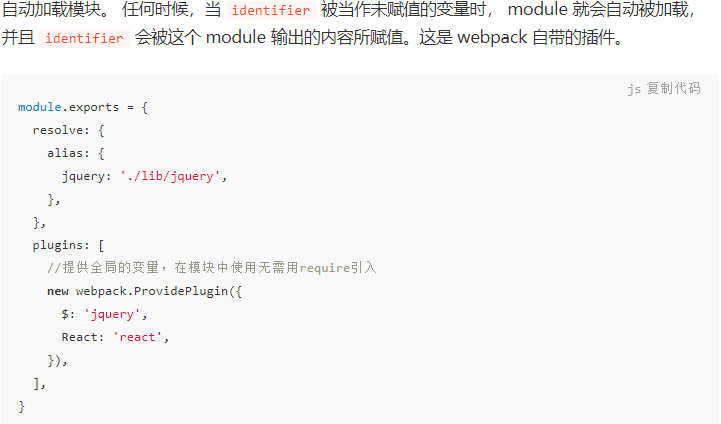

## webpack4 

### 一行代码打包1 

1. 需要安装 `webpack webpack -D`
2. 生产环境打包 `webpack src/a.js -o ./dist/res.js --mode=development`

3. 正式环境打包 `webpack src/a.js -o ./dist/res.js --mode=production`


### 一行代码打包2：

利用webpack.config.js 简单打包 `webpack`

### 开发服务

利用 webpack-dev-server  配置一下webpack.config.js中的

```js
// webpack.config.js
devServer:{
  contentBase: path.resolve(__dirname,'dist'),
  // gzip压缩
  compress: true,
  port: 3000
}
// 运行： npx webpack-dev-server
```

### 特点

1. webpack可直接处理js/json
2. webpack4有mode:'development'/'production' 开发/生产模式,两种模式下有一些默认配置
3. webpack v4.26.0把默认的 uglifyjs-webpack-plugin改为terser-webpack-plugin,所以默认生产环境可以压缩js
4. webpack4 抽取css用  mini-css-extract-plugin， webpack3抽取css用extract-text-webpack-plugin 
5. babel 转换箭头函数，解决低版本兼容
6. postcss-preset-env 包含 autoprefixer (css前缀)

### 问题

1. 完整的css各种打包细节太麻烦了，目前less文件中使用 @import后，postcss无法添加前缀

### source-map

source-map: 一种 提供源代码到构建后代码映射 技术 （如果构建后代码出错了，通过映射可以追踪源代码错误）

```js
/*
[inline-|hidden-|eval-][nosources-][cheap-[module-]]source-map

source-map：外部
  错误代码准确信息 和 源代码的错误位置
inline-source-map：内联
  只生成一个内联source-map
  错误代码准确信息 和 源代码的错误位置
hidden-source-map：外部
  错误代码错误原因，但是没有错误位置
  不能追踪源代码错误，只能提示到构建后代码的错误位置
eval-source-map：内联
  每一个文件都生成对应的source-map，都在eval
  错误代码准确信息 和 源代码的错误位置
nosources-source-map：外部
  错误代码准确信息, 但是没有任何源代码信息
cheap-source-map：外部
  错误代码准确信息 和 源代码的错误位置 
  只能精确的行
cheap-module-source-map：外部
  错误代码准确信息 和 源代码的错误位置 
  module会将loader的source map加入

内联 和 外部的区别：1. 外部生成了文件，内联没有 2. 内联构建速度更快

开发环境：速度快，调试更友好
  速度快(eval>inline>cheap>...)
    eval-cheap-souce-map
    eval-source-map
  调试更友好  
    souce-map
    cheap-module-souce-map
    cheap-souce-map

  --> eval-source-map  / eval-cheap-module-souce-map    //开发用 eval-source-map

生产环境：源代码要不要隐藏? 调试要不要更友好
  内联会让代码体积变大，所以在生产环境不用内联
  nosources-source-map 全部隐藏
  hidden-source-map 只隐藏源代码，会提示构建后代码错误信息

  --> source-map / cheap-module-souce-map  // 生产用 source-map
*/
```

## 开发优化

### hmr

css热更新、js太麻烦

js处理

```js
// xx.js
import aa from './aa.js'
if (module.hot) {
  // 一旦 module.hot 为true，说明开启了HMR功能。 --> 让HMR功能代码生效
  module.hot.accept('./aa.js', function() {
    // 方法会监听 print.js 文件的变化，一旦发生变化，其他模块不会重新打包构建。
    // 会执行后面的回调函数
    print();
  });
}
```


### sourcemap

感觉不需要

## 打包优化

### one-of

loader只加载一个，匹配到某loader后，后面就停止匹配

### 缓存

每次wepack构建时会生成一个唯一的hash值。

```
/*
  缓存：
    babel缓存
      cacheDirectory: true
      --> 让第二次打包构建速度更快
    文件资源缓存
      hash: 每次wepack构建时会生成一个唯一的hash值。
        问题: 因为js和css同时使用一个hash值。
          如果重新打包，会导致所有缓存失效。（可能我却只改动一个文件）
      chunkhash：根据chunk生成的hash值。如果打包来源于同一个chunk，那么hash值就一样
        问题: js和css的hash值还是一样的
          因为css是在js中被引入的，所以同属于一个chunk
      contenthash: 根据文件的内容生成hash值。不同文件hash值一定不一样    
      --> 让代码上线运行缓存更好使用
*/
```

### tree shaking

 （树摇）去除无用代码，比如未使用的js函数不会被打包进去，减少代码体积

```js
 前提：1. 必须使用ES6模块化  2. 开启production环境
    作用: 减少代码体积
    默认不需要 package.json配置，可能某些webpack版本会把css @babel/polyfill等给删除，可通过 sideEffects:["*.css"]来保留css等不被删除

    在package.json中配置 
      "sideEffects": false 所有代码都没有副作用（都可以进行tree shaking）
        问题：可能会把css / @babel/polyfill （副作用）文件干掉
      "sideEffects": ["*.css", "*.less"]
```

### code split

代码分割：

1.多入口

2.webpack配置 splitChunks

3.单独打包某js文件

```js
import(/* webpackChunkName: 'test' */'./js/c')
```

### 懒加载/预加载

建立在code split的第3点 import()上， 预加载prefetch有兼容性问题，少用

### pwa

1. serviceworker 离线缓存，有webpack插件
2. 需要在js中注册 serviceWorker
3. 最后打包出来的代码，必须运行在服务器才会生效

### offline-plugin

又一个pwa方案  [介绍](https://segmentfault.com/a/1190000010669126)

### 多进程打包

#### thread-loader

`yarn add thread-loader -D`  当js文件多时，提高加包速度

用在babel-loader上，如果js代码太少，反而打包速度慢

```js
{
  test: /\.js$/,
  exclude: /node_modules/,
  use: [
      /* 
      开启多进程打包。 
      进程启动大概为600ms，进程通信也有开销。
      只有工作消耗时间比较长，才需要多进程打包
    */
    {
        loader: 'thread-loader',
        options: {
            workers: 2 // 进程2个
        }
    },
    {
        loader: 'babel-loader',
    }   
```

#### happyPack 

[多进程打包](https://juejin.im/post/5ee9c98c6fb9a0587c6b136c#heading-15) 项目太小反而会慢

### cache-loader

在一些性能开销较大的 loader 之前添加 cache-loader，以便将结果缓存到磁盘里

只打算给 `babel-loader` 配置 `cache` 的话，直接在 babel-loader 设置  cacheDirectory：true就行了，不用这个

### externals

不打包cdn

要在html中手动引入cdn

```js
externals:{
  jquery:'jQuery'
}
```

### dll 

对node_modules中的jq vue react包单独打包

（上面的code split 中的webpack配置 splitChunks会把 node_modules只打成一个包，可能体积太大）

1. 需要先运行 webpack --config webpack.dll.js 执行 dll.js文件打包文件映射
2. 再在webpack.build.config.js再引入映射文件

```js
// webpack.dll.js
/*
  使用dll技术，对某些库（第三方库：jquery、react、vue...）进行单独打包
    当你运行 webpack 时，默认查找 webpack.config.js 配置文件
    需求：需要运行 webpack.dll.js 文件
      --> webpack --config webpack.dll.js
*/

const { resolve } = require('path');
const webpack = require('webpack');

module.exports = {
  entry: {
    // 最终打包生成的[name] --> jquery
    // ['jquery'] --> 要打包的库是jquery
    jquery: ['jquery'],
  },
  output: {
    filename: '[name].js',
    path: resolve(__dirname, 'dll'),
    library: '[name]_[hash]' // 打包的库里面向外暴露出去的内容叫什么名字
  },
  plugins: [
    // 打包生成一个 manifest.json --> 提供和jquery映射
    new webpack.DllPlugin({
      name: '[name]_[hash]', // 映射库的暴露的内容名称
      path: resolve(__dirname, 'dll/manifest.json') // 输出文件路径
    })
  ],
  mode: 'production'
};

```


```js
// webpack.config.js
const { resolve } = require('path');
const HtmlWebpackPlugin = require('html-webpack-plugin');
const webpack = require('webpack');
const AddAssetHtmlWebpackPlugin = require('add-asset-html-webpack-plugin');

module.exports = {
  entry: './src/index.js',
  output: {
    filename: 'built.js',
    path: resolve(__dirname, 'build')
  },
  plugins: [
    new HtmlWebpackPlugin({
      template: './src/index.html'
    }),
    // 告诉webpack哪些库不参与打包，同时使用时的名称也得变~
    new webpack.DllReferencePlugin({
      manifest: resolve(__dirname, 'dll/manifest.json')
    }),
    // 将某个文件打包输出去，并在html中自动引入该资源
    new AddAssetHtmlWebpackPlugin({
      filepath: resolve(__dirname, 'dll/jquery.js')
    })
  ],
  mode: 'production'
};

```

### browserslist

```json
"browserslist": [
  "> 1%",   // 全球浏览器使用率大于1%。
  "last 2 versions",   // 每个浏览器中最新的两个版本。
  "not ie <= 8"
]
```

### providePlugin



### IgnorePlugin

忽略第三方包指定目录   [IgnorePlugin](https://juejin.im/post/5ee9c98c6fb9a0587c6b136c#heading-17)

### preload-webpack-plugin  

预加载 js css   

<link rel="preload" as="script" href="chunk.31132ae6680e598f8879.js">

### pnp-webpack-plugin 

加快node_modules 找模块的速度   [介绍](https://juejin.im/post/5ca97b516fb9a05e132110fd)

### minimist

轻量级的命令行参数解析引擎 [介绍](https://jarvys.github.io/2014/06/01/minimist-js/)

### case-sensitive-paths-webpack-plugin

防止不同的系统下对于大小写的问题导致路径出错

### address 

 获取ip地址

## 以上优化分类

开发环境性能优化

* 优化打包构建速度
  * HMR
* 优化代码调试
  * source-map

生产环境性能优化

* 优化打包构建速度
  * oneOf
  * babel缓存
  * 多进程打包
  * externals
  * dll
* 优化代码运行的性能
  * 缓存(hash-chunkhash-contenthash)
  * tree shaking
  * code split
  * 懒加载/预加载
  * pwa

## package.json

```json
"@babel/core": "^7.10.4",
"@babel/preset-env": "^7.10.4",
"babel-loader": "^8.1.0",
"clean-webpack-plugin": "^3.0.0",     // 清空文件夹
"copy-webpack-plugin": "^6.0.3",      // 复制文件
"core-js": "^3.6.5",                  
"css-loader": "^3.6.0",
"eslint": "^7.4.0",
"eslint-config-airbnb-base": "^14.2.0",  // eslint的 airbnb标准
"eslint-loader": "^4.0.2",
"eslint-plugin-import": "^2.22.0",
"file-loader": "^6.0.0",
"html-loader": "^1.1.0",
"html-webpack-plugin": "^4.3.0",
"less": "^3.11.3",
"less-loader": "^6.2.0",
"mini-css-extract-plugin": "^0.9.0",   // 提取css 
"optimize-css-assets-webpack-plugin": "^5.0.3",   // 压缩css 前面依赖后面 cssnano也是压缩css
"postcss-loader": "^3.0.0",
"postcss-preset-env": "^6.7.0",
"purify-css": "^1.2.5",         // // 删除多余的css
"purifycss-webpack": "^0.7.0",  // 删除多余的css
"style-loader": "^1.2.1",
"url-loader": "^4.1.0",
"webpack": "^4.43.0",
"webpack-cli": "^3.3.12",  // webpack4 必装
"webpack-dev-server": "^3.11.0",   // server
"workbox-webpack-plugin": "^5.1.3"   // pwa
```

## 其他插件

1. webpack-bundle-analyzer  生成代码分析报告，写webpack配置时才用？？

2. webpack-merge  合并配置 webpack.common.js   webpack.dev.js webpack.production.js

3. webpack-chain 链式配置webpack 。当项目的 webpack 配置需要根据某些逻辑生成的时候

   ```js
   const Config = require('webpack-chain');
   const config = new Config();
   config
     .entry('app')
       .add('src/index.js')
   //它等价于 webpack 配置对象的这部分：
   entry: {
     app: './src/index.js'
   }
   ```

4. webpack-cdn-plugin  把vue.min.js 以cdn形式直接在html中script中引入

5. 

# webpack5

yarn add webpack@next webpack-cli -D

专注性能、tree shaking https://github.com/webpack/changelog-v5

webpack包无穷无尽，有些包还会过时、冲突，真可怕~ 