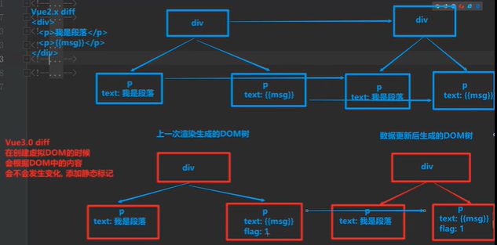

## vue3

### vue3/vue2区别
vue3根本不需要关心具体的 key，它去拦截的是 「修改 data 上的任意 key」 和 「读取 data 上的任意 key」

```
new Proxy(data, {
  get(key) { },
  set(key, value) { },
})
```
// Vue2 中，对于给定的 data，如 { count: 1 }，是需要根据具体的 key 也就是 count，去对「修改 data.count 」 和 「读取 data.count」进行拦截
```
Object.defineProperty(data, 'count', {
  get() {},
  set() {},
})
```

### vue3入门

[vue3.0上手体验](https://www.cnblogs.com/wjaaron/p/12993385.html)

1. 在vue-cli4的基础上，`vue add vue-next`升级为vue3 beta 【过时了】

2. vue3 router vuex都为4.0

3. vue3用到啥引入啥，只打包用到的api

4. api可能会变，还是要等正式版上线

5. [vue3部分api](https://composition-api.vuejs.org/zh/)

6. 另外，`npm i @vue/cli@latest -g`  `yarn global add @vue/cli`  

   vue-cli v4.5.6 再  `vue create xxx`，可以直接创建vue3项目

### ref watch computed reactive

```vue
<template>
  <div class="about">
    <h1>This is an about page</h1>
    <p>{{count}}</p>
    <button @click="add">+1</button>
    <p>{{double}}</p>
    <button @click="add2">+2</button>
    <p>{{state.num}}</p>
    <button @click="addNum">addNum</button>
  </div>
</template>
<script>
  import { ref, watch, computed, reactive,toRefs } from 'vue';  // 手动引入。。

  export default {
    setup () {   // 全都要写在setup() 里
      // 1.ref声明响应式数据
      const count = ref(0);
      const add = () => count.value++;   // 使用xx.value来访问
      watch(   // 两个参数都是函数，第一个是返回要监听的值，第二个是回调函数
        () => count.value,
        (val, oldVal) => {
          console.log(`new val: ${val},old val:${oldVal}`);
        }
      );
      const double = computed(() => count.value * 2);

      // 2.reactive声明响应式数据
      const state = reactive({   // 这种也麻烦 显示要 {{state.num}}
        num: 3,
        age: 4,
      });
      // 3.reactive 简单版
        const hobbyObj = reactive({
            hobby:'haha'
        })
      // 两种方式都要返回
      return {
        count,
        add,
        double,
        add2: () => count.value += 2,
        state,
        addNum: () => state.num++,    // 这里就不用.value
        ...toRefs(hobbyObj), // 解购加响应式， 页面可直接 {{hobby}}  
      };
    }
  };
</script>
```
### readonly,onMounted,toRef,toRefs,shallowReactive,watchEffect

```vue
<template>
  <div class="about">
    {{readonly1.num}}
    age:{{age2}}
    {{obj.name+','+obj.age}}

    <hr/>
    {{name}}{{age}}
    <hr>
    <div @click="stateAdd">{{state.nested.bar}} {{state.foo}}</div>
  </div>
</template>
<script>
  import { readonly,onMounted,reactive,toRef,toRefs,shallowReactive,ref,watchEffect } from 'vue';

  export default {
    setup () {
      const readonly1 = readonly({
        num: 3,
      });
      const obj = reactive({
        name:'kang',
        age:31
      })

      const age2 = toRef(obj,'age')   // 把 reactive的某属性转成  ref()
      age2.value = 20

      readonly.num = 4;  // readonly只读，修改无效
      const test1 = async ()=>{
        console.log(readonly1.num);
      }
      onMounted(test1)

      let obj2 = toRefs(obj)   // 把 reactive全部属性转成  ref()

      const {age,name} = obj2  // 解构赋值
      console.log(obj2.age.value,age.value,name.value);  // 20


      // shallowReactive 嵌套的对象不进行响应式
      const state = shallowReactive({
        foo: 1,
        nested: {
          bar: 2
        }
      })
      state.nested.bar++  // 直接修改,页面也会显示最新值 3
      const add = ()=> {
        state.nested.bar=100
        state.foo= 66  // 同时修改第一层属性，嵌套值bar也会更新
        console.log('bar',state.nested.bar);
      }
      const watchNum = ref(22)
      watchEffect(()=>{console.log('watchNum',watchNum.value)})  // 立即执行
      setTimeout(()=>{
        watchNum.value++;   // 响应数据变更时，会再执行
      },1000)
      return {
        readonly1,
        age2,
        obj,
        // ...obj2,  // 这里跟  const {age,name}=obj2 return {age,name} 效果一致
        age,
        name,
        state,
        stateAdd:add
      };
    }
  };
</script>
```

[vue3 api](https://v3.cn.vuejs.org/api/basic-reactivity.html#reactive)

### setup

没有this 在 created之前执行，同步函数，不能用async  this的值为undefined

### compositon api

```vue
<template>
  <div class="about">
    <input type="text" v-model="addObj.id">
    <input type="text" v-model="addObj.name">

    <button @click="add">add</button>
    <div class="list">
      <div class="item" v-for="(val,key) in list" :key="key" @click="del(key)">
        {{val.id}}----{{val.name}}
      </div>
    </div>
  </div>
</template>
<script>
  import { reactive } from 'vue';  // 手动引入。。
  import delFn from './delFn';

  export default {
    setup () {
      let {list, del} = delFn();  // 也可从js文件引入
      let {addObj, add} = addFn(list);
      return {
        list, del, addObj, add
      };
    }
  };

  // 独立功能函数
  function addFn (list) {
    let addObj = reactive({
      id: '',
      name: ''
    });

    function add () {
      // list.push(addObj)  // 不能偷懒
      /*let obj = Object.assign({},addObj)  // 需要复制一份
      list.push(obj)*/
      list.push({
        id: addObj.id,
        name: addObj.name
      });
      addObj.id = '';
      addObj.name = '';
    }

    return {addObj, add};
  }
</script>
```

```js
// delFn.js
import { reactive } from 'vue';
function delFn () {
  let list = reactive([
    {id: 1, name: 'xx33'},
    {id: 2, name: 'xx254'},
    {id: 3, name: 'xx36464'},
  ]);

  function del (key) {
    list.splice(key, 1);
  }

  return {list, del};
}
export default delFn;
```

vue2的组件选项 (`data`、`computed`、`methods`、`watch`) 还是可在vue3中用，但组件很大时，可用composition API 把各个功能逻辑分散到不同文件中去，代码变简洁。也可混合用，代码执行时，会把 composition api 注入到 data()、methods中去.  至于用不用comosition api，看具体情况吧

[composition Api](https://v3.cn.vuejs.org/guide/composition-api-introduction.html#什么是-composition-api)

### shadowRef

使用shadowRef时,vue监听的是.value的变化，要响应式必须修改.value值

```js
// 一般用 Ref/reactive,  数据量大才考虑 shadowRef/shadowReactive
let state = shallowRef({  // 注意，这里是个对象了 shallowRef({a:'a'}) ->  ref(0)
	a:'a',
	gf:{
		b:'b'
	}
})
state.value.a='1' // 无效
// 这样修改才有效，并且要写完整整个对象
state.value = {
  a:'1',
  gf:{
  	b:'2'
  }
}
// 只修改一个数据时,要借助 triggerRef来触发页面更新
state.value.gf.b='666'
triggerRef(state)  // 没有 triggerReactive
// 本质
// ref(10) -> reactive({value:10})
// shallowRef({num:10}) -> shallowReactive({value:{num:10}})
```

### toRaw

取消响应式，某些操作不需要更新UI时，使用

```js
<template>
  <div class="about">
    {{obj.name}} -  {{obj3}}
    <button @click="add">btn</button>
  </div>
</template>
<script>
  import { reactive, toRaw,ref } from 'vue';  // 手动引入。。

  export default {
    setup () {
      let obj = reactive({
        name: 'kang',
      });
      let obj2 = toRaw(obj);
      obj2.name = 'abc';   // 直接修改还是会更新UI的
      let obj3 = ref(10)
      let obj33 = toRaw(obj3.value)  // ref需要添加.value
      function add () {
        obj2.name = 'jia';   // 通过点击就不会
        obj33 = 20
        console.log(obj2,obj33);
      }

      return {
        obj, add,obj3
      };
    }
  };

</script>
```

### markRaw

// 阻止响应式

```js
let obj = markRaw({name:'kang'})
let data = reactive(obj)  // 响应式无效
```

### toRef

使ui不更新

```vue
<template>
    {{age}}
    <button @click="add">btn</button>
</template>
<script>
  import { toRef} from 'vue';  // 手动引入。。

  export default {
    setup () {
      let obj2 = {age:12}
      let age = toRef(obj2,'age')
      age.value= 'xx'
      function add () {
        age.value = 30   // UI不更新
        console.log(age);
        console.log(obj2);
      }
      return {
        name,add,age
      };
    }
  };

</script>
```

### teleport

[teleport](https://v3.vuejs.org/guide/teleport.html) 组件可以挪位置

```vue
<!-- xx.vue to 属性就是目标位置 -->  
<teleport to="#abcd">
  <div class="toast-wrap">xxx</div>
</teleport>
<!-- index.html -->
<div id="app"></div>
<div id="abcd"></div>
```

### vue props emit

```vue
<!-- son.vue -->
<template>
  <div>
    hi,{{msg}}
    <button @click="clickBtn">btn</button>
  </div>
</template>

<script>
  import { toRefs } from 'vue';

  export default {
    props: {
      msg: String,  // 必须是构造函数 vue3限制的
    },
    setup (props,context) {
      /*let proxy = new Proxy({age:30},{})
      console.log(proxy);
      console.log({...proxy});  // proxy 直接 解构后会失去 proxy响应式， 因此需要 toRefs
      */
      // const {msg} = props;
      const {msg} = toRefs(props);
      // console.log(msg.value);
      console.log(context);  // attrs slots emit
      const {emit} = context
      const clickBtn = ()=>{
        context.emit('test-btn')  // vue3限制  必须用中划线， testBtn报错
      }
      return {
        clickBtn,
      }
    },
  };

</script>

<!-- about.vue -->
<template>
  <div class="about">
    <son :msg="msg" @test-btn="testBtn"/>
  </div>
</template>
<script>
  import son from './common/son';
  import { ref } from 'vue';

  export default {
    components: {
      son
    },
    setup () {
      const msg = ref('xiao ming');
      setTimeout(() => {
        msg.value = 'hello';
      }, 1000);
      const testBtn = ()=>{
        console.log('hi');
      }
      return {
        msg,   // 直接给组件用
        testBtn,
      };
    },
  };
</script>
```

### reflect

```js
let product = {num:3}

console.log(Reflect.get(product, 'num'));   // Reflect 反射  一般情况下，跟 product.num 效果一样
```

### proxy

```js
let product = {num:3}
let proxyProduct = new Proxy(product,{})

console.log(proxyProduct.num);  // 3
```

### vue-lit

[vue-lit](https://github.com/axuebin/articles/issues/41) 直接在js中写组件？

```html
<!DOCTYPE html>
<html lang="en">
<head>
  <script type="module">
    import {
      defineComponent,
      reactive,
      html,
      onMounted
    } from 'https://unpkg.com/@vue/lit@0.0.2';

    defineComponent('my-component', () => {
      const state = reactive({
        text: 'Hello World',
      });

      function onClick() {
        state.text='world'
      }

      onMounted(() => {
        console.log('mounted');
      });

      return () => html`
          <p>
            <button @click=${onClick}>Click me</button>
            ${state.text}
          </p>
        `;
    })
  </script>
</head>
<body>
<my-component />
</body>
</html>
```

### vue3 vite 

1. 直接运行vue文件，不用webpack打包，利用浏览器的 `<script type = 'module'>`
2. 利用koa
3. 热更新使用了webSocket   

[github](https://github.com/vitejs/vite)

[vite1](https://segmentfault.com/a/1190000023009604)

[vite源理](https://mp.weixin.qq.com/s?__biz=Mzg5ODA5NTM1Mw==&mid=2247489706&idx=1&sn=79be78bae7f93fd06136853eb9e8fc52&chksm=c066993cf711102ad214a266662f280e2a65ef79a1bd74c992a685a5957048133f13efb9ef8b&scene=126&sessionid=1600826002&key=0acde1ff6de13ef42b238e337c9c1c3ed4df365c911239b9f1840f311037dc7c0d570dcd1f27d696bfc83e2b0da0e9f779bf65f249e0e44c60d16e6001283c828dc19cd071e696c0900c63cbb1688b36f797a60d76bb007e46204d11b116913ec166f127c0b5ab007fe281c38872fc60b2e7630d000c4179e1f93b6a30bf06d6&ascene=1&uin=MzgxOTk1Nzk1&devicetype=Windows+10+x64&version=62090529&lang=zh_CN&exportkey=A2xjAvEjRAhUpaG3qK5GqTg%3D&pass_ticket=oh2AqZFBIb3xGS1oqJIeWNiRipKZoKCZDeS7wshwBjJJ0mt0XHItwt9IGENAqQli&wx_header=0) 改用 rollup打包了。。。

### vue3最新源码

[vue-next](https://github.com/vuejs/vue-next)

## 2020-09-22

[vue3文档](https://v3.cn.vuejs.org) 感觉跟vue2差不多

[treeshaking](https://v3.vuejs.org/guide/migration/global-api-treeshaking.html#_2-x-syntax) nextTick 等要自己引入，不引不会打包

ts

[vue3.0总结](https://blog.csdn.net/qq_30640671/article/details/108679708) [vue3.0总结](https://blog.csdn.net/weixin_36065510/article/details/108679867) 两个差不多

vite  EsBuild 工具 替换 tsc 

reactivity module 

compiler module： 把html template-> render 函数

renderer module

​     render函数-> 虚拟dom -> 挂载到页面  

​	补丁，对比新旧虚拟dom,更新页面

### vue3 eslint

```json
"eslintConfig": {
    "root": true,
    "env": {
      "node": true
    },
    "extends": [
      "plugin:vue/vue3-essential",
      "eslint:recommended"  // 去掉 eslint
    ],
    "parserOptions": {
      "parser": "babel-eslint"
    },
    "rules": {
      "no-unused-vars": "off"  // 或关闭具体的rule 
    }
  },
```

### vnode

```js
// dom 通过render()转为 vnode
// vnode
{
	tag:'div',
	children:[
		{text:'hello'}
	]
}
```

## vue3优化点

### diff优化

添加静态标记，更新时，只对比标记的元素{{msg}}, 其他静态元素<p>xx</p>不进行对比



### hoistStatic静态提升

通过render函数生成虚拟dom时，静态元素<p>xx</p>不重新生成

https://vue-next-template-explorer.netlify.app/

### 事件监听器缓存	

```
<div @click='test'>btn</div>
vue2会追踪它的变化， vue3直接缓存
```

### vue3改动的语法

```
1. vue3又支持<template>多根标签了，vue2只支持一个根标签，vue1支持多根标签
2. vue3删除了filter 
3. 异步组件，加个 const xxx = defineAsyncComponent(()=>import('xx.vue'))
4. $on，$off 和 $once 实例方法已被移除, bus也没了，自己写或用插件。。剩下$emit
5. v-model 的 .sync 改了。。

```

[v-model](https://vue3js.cn/docs/zh/guide/migration/v-model.html#v-model-%E5%8F%82%E6%95%B0)

[vue3的不同](https://juejin.im/post/6875573837250068493)

## 问题

### render ??

```vue
<script>
import {h} from 'vue'
render(){
	return h('div',{id:'foo',onClick:this.onClick},'hello');
/**   
// v-if 也可以let res = xx  if(this.ok){res='xxx'}else{res='xxxx'} return res
	return this.ok
        ? h('div',{id:'hello'},[h('span','world')])
        : h('p','other mes')
 */
// v-for
    return this.list.map(item=>{
        return h('div',{key:item.id},item.text)
    })
}
</script>
```

1. render函数什么时候用？

    使用<template>不方便的时候，如   <h1>xx</h1>  <h2>xx</h2>  <hn>xx</hn> 

